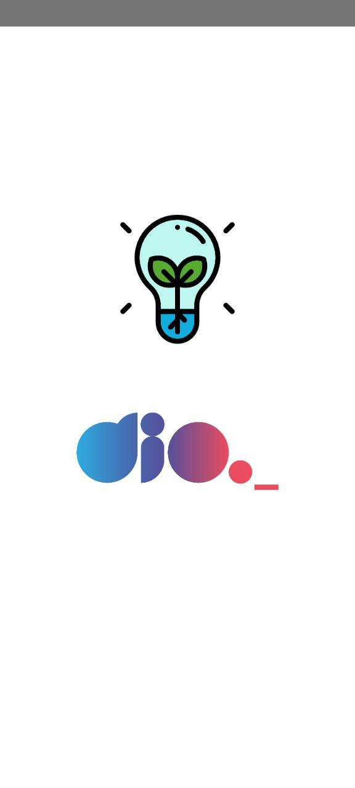

# DioFlashLight

## Capturas de tela

## Conteúdo
- Libs react-native-shake e react-native-torch
- icons: https://drive.google.com/drive/folders/1aDTyA09EFjFvqmXqkDKLoMhFx65QQExQ
- Apps: [release](./storage/)
- StyleSheet
- Hook useState
- Hook useEffect
- Add Listener to RNShake
- Lifecicly ReactJS